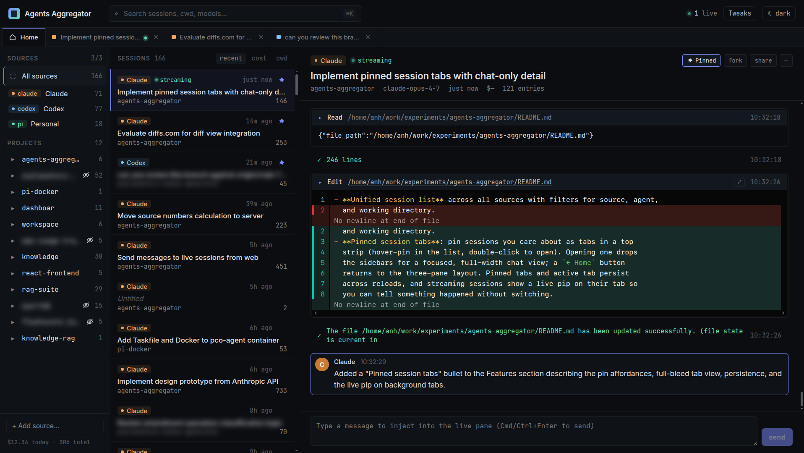

# Agents Aggregator

A local web app that aggregates AI coding-agent session history across multiple
agents and accounts, streams live updates as the agents run, and lets you send
input back to agents running inside tmux.

Each agent stores its session history in its own format under your home
directory. If you use several agents — or several accounts of the same agent —
your history is scattered across `~/.claude`, `~/.claude-work`, `~/.codex`,
`~/.codex-personal`, `~/.opencode`, `~/.pi`, etc. Agents Aggregator points at
those folders, indexes them in a local SQLite database, and gives you one place
to browse, filter, search, and watch sessions unfold live.

Runs entirely on your machine. No cloud, no auth, single process.

> **Status:** early / experimental (`0.1.0`). The session-file formats it reads
> are not stable APIs of the upstream agents, so breakage between agent
> releases is possible — please open an issue if you see one.



Or Watch me building it in realtime: https://www.youtube.com/watch?v=ACWjW-3LFS0

## Supported agents

| Agent       | Folder layout                                                 |
|-------------|---------------------------------------------------------------|
| Claude Code | `~/.claude/projects/<encoded-cwd>/<uuid>.jsonl`               |
| Codex CLI   | `~/.codex/sessions/YYYY/MM/DD/rollout-<uuid>.jsonl`           |
| Pi          | `<root>/agent/sessions/<encoded-cwd>/<file>.jsonl`            |
| OpenCode    | `~/.local/share/opencode/opencode.db` (SQLite, read-only)     |

## Features

- **Multi-agent support** for Claude Code, Codex CLI, OpenCode, and Pi — all
  in one UI.
- **Multiple profiles per agent**: point at as many Claude Code or Codex
  homes as you like (e.g. `~/.claude`, `~/.claude-work`, `~/.codex`,
  `~/.codex-personal`) and browse them side by side. See
  [Running multiple profiles](#running-multiple-profiles) below.
- **Live session streaming** via Server-Sent Events. Open the UI on one
  monitor, use your agent on another, and watch messages stream in without
  refreshing. (OpenCode sessions update on rescan rather than live —
  they're SQLite-backed, not JSONL-tailed.)
- **Send input from the web → live session** (when the session runs inside
  tmux): type into the UI and it's delivered to the agent's terminal via
  `tmux send-keys`, so you can drive a running agent from your browser.
- **Inline image rendering**: screenshots and other images you attach to a
  message are rendered directly in the transcript.
- **Diff view and syntax-highlighted file view** for file edits and code
  blocks — assistant messages, tool results, and file reads all get proper
  highlighting instead of raw text.
- **Unified session list** across all sources with filters for source, agent,
  and working directory.
- **Pinned session tabs**: pin sessions you care about as tabs in a top
  strip (hover-pin in the list, double-click to open). Opening one drops
  the sidebars for a focused, full-width chat view; a `← Home` button
  returns to the three-pane layout. Pinned tabs and active tab persist
  across reloads, and streaming sessions show a live pip on their tab so
  you can tell something happened without switching.
- **Normalized rendering** of user / assistant / tool-call / tool-result /
  thinking / bash blocks regardless of which agent produced them.
- **Per-file tailing** with debounced `fs.watch`, byte-offset tracking, and
  truncation detection.

## Keyboard shortcuts

| Shortcut       | Action                                                  |
|----------------|---------------------------------------------------------|
| `⌘1` / `Ctrl+1`| Switch to the **Home** tab                              |
| `⌘2` … `⌘9`    | Switch to the pinned session tab at that index          |
| `⌘W` / `Ctrl+W`| On a session tab: unpin it and return to **Home**       |
| `⌘⇧P` / `Ctrl+Shift+P` | Toggle pin on the focused session              |
| `⌘/Ctrl + Enter` | In the send box: deliver the message to the live pane |

Shortcuts are ignored while an input or textarea has focus, so typing in
search or the send box won't trigger them. On Windows / Linux, use `Ctrl`
in place of `⌘`. Browsers may intercept `⌘W` before the app sees it
(closing the page); on those browsers, click the tab's `×` instead.

## Running multiple profiles

Both Claude Code and Codex respect an env var that points at their home
directory, so you can keep multiple independent profiles (different accounts,
different workspaces) and aggregate them all here.

Codex uses `CODEX_HOME`:

```bash
alias codex-one="CODEX_HOME=~/.codex-one codex"
alias codex-two="CODEX_HOME=~/.codex-two codex"
```

Claude Code uses `CLAUDE_CONFIG_DIR`:

```bash
alias claude-one="CLAUDE_CONFIG_DIR=~/.claude-one claude"
alias claude-two="CLAUDE_CONFIG_DIR=~/.claude-two claude"
```

Then add each directory as a source:

```bash
npm run cli -- source add ~/.claude-one --label "Claude (personal)"
npm run cli -- source add ~/.claude-two --label "Claude (work)"
npm run cli -- source add ~/.codex-one  --label "Codex (personal)"
npm run cli -- source add ~/.codex-two  --label "Codex (work)"
```

## Requirements

- Node.js 18 or newer
- `tmux` (optional — only needed for the "send input to a running session"
  feature)

## Install and run

```bash
git clone https://github.com/<your-org>/agents-aggregator.git
cd agents-aggregator
npm install
```

Add at least one source folder:

```bash
npm run cli -- source add ~/.claude
npm run cli -- source add ~/.codex
npm run cli -- source add ~/.local/share/opencode
npm run cli -- source add ~/.pi
```

Start the dev server (Hono API on `:3000`, Vite UI on `:5173`):

```bash
npm run dev
```

Open <http://localhost:5173>.

## Configuration

Sources live in `~/.config/agents-aggregator/config.json` (or
`$XDG_CONFIG_HOME/agents-aggregator/config.json`). The SQLite index lives next
to it as `index.db`. Both are created on first run.

```json
{
  "sources": [
    {
      "id": "claude",
      "label": "Claude",
      "agent": "claude",
      "root": "/home/you/.claude",
      "enabled": true
    }
  ]
}
```

You can hand-edit this file or manage it via the CLI.

## CLI

```bash
npm run cli -- source add <root> [--label <label>] [--agent <agent>] [--id <id>]
npm run cli -- source list
npm run cli -- source remove <id>
npm run cli -- source enable <id>
npm run cli -- source disable <id>
npm run cli -- scan          # re-index all enabled sources
```

`<agent>` is one of `claude`, `codex`, `opencode`, `pi`. Omit it to auto-detect
from the folder layout.


## Architecture

```
Source folders (~/.claude, ~/.codex, ~/.local/share/opencode, ~/.pi, …)
        │
        ▼
  Watcher (fs.watch on .jsonl, recursive, debounced ~100ms)
        │
  Parser per agent (claude, codex, opencode, pi)
        │
  Indexer → SQLite (better-sqlite3)
        │
  In-process pub/sub
        │
  Hono API + SSE  ──►  React + Vite UI
```

| Layer    | Choice                                                  |
|----------|---------------------------------------------------------|
| Runtime  | Node + TypeScript                                       |
| Server   | Hono with native SSE                                    |
| DB       | better-sqlite3                                          |
| Watcher  | `fs.watch({ recursive: true })`, debounced              |
| Frontend | Vite + React, `EventSource` for live updates            |
| Config   | `~/.config/agents-aggregator/config.json` (zod-validated)|
| Logging  | pino                                                    |

## Project layout

```
src/
├── shared/types.ts             # Source, Session, Entry, Block
├── server/
│   ├── index.ts                # entrypoint
│   ├── config.ts               # config.json load/save
│   ├── paths.ts                # XDG-style config/data paths
│   ├── logger.ts               # pino logger
│   ├── db.ts                   # SQLite repos
│   ├── indexer.ts              # initial scan + upsert
│   ├── watcher.ts              # fs.watch + debounce
│   ├── pubsub.ts               # in-process fanout
│   ├── tmux.ts                 # pane resolution + send-keys
│   ├── api.ts                  # Hono routes + SSE
│   ├── cli.ts                  # CLI
│   └── parsers/
│       ├── base.ts             # Parser interface + sniffer
│       ├── index.ts            # agent → parser lookup
│       ├── claude.ts
│       ├── codex.ts
│       ├── opencode.ts         # SQLite-backed (reads opencode.db)
│       └── pi.ts
└── ui/                         # React app (Vite + TanStack Router)
```

## API

The HTTP API is exposed on port `3000` (the Vite dev server proxies `/api`).

| Route                                              | Description                       |
|----------------------------------------------------|-----------------------------------|
| `GET  /api/sources`                                | List configured sources           |
| `GET  /api/sessions?source=&agent=&q=&project=`    | List sessions with filters        |
| `GET  /api/projects`                               | List distinct project (cwd) values|
| `GET  /api/sessions/:sourceId/:sessionId`          | Session metadata                  |
| `GET  /api/sessions/:sourceId/:sessionId/entries`  | All entries for a session         |
| `GET  /api/sessions/:sourceId/:sessionId/file?path=` | Read a file from the session's cwd (sandboxed) |
| `POST /api/sessions/:sourceId/:sessionId/input`    | Send `{ text }` to the tmux pane  |
| `GET  /api/events`                                 | SSE stream of activity            |

## Build

```bash
npm run build      # tsc -b && vite build
npm run preview    # serve the built UI
```

## Contributing

Issues and PRs welcome. The parser layer is the easiest place to contribute:
implement the `Parser` interface in `src/server/parsers/base.ts` for a new
agent and wire it into `src/server/parsers/index.ts`. The existing parsers
are good references for the shape of the work — `claude.ts`, `codex.ts`,
and `pi.ts` for JSONL-on-disk formats, and `opencode.ts` for a
SQLite-backed format. All of them sniff, parse session metadata, and
normalize into the shared `Entry`/`Block` types in `src/shared/types.ts`.

## License

[MIT](./LICENSE) © Anh Trinh
